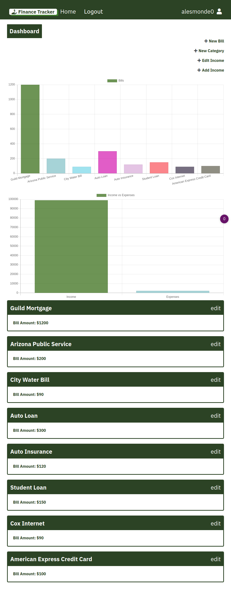
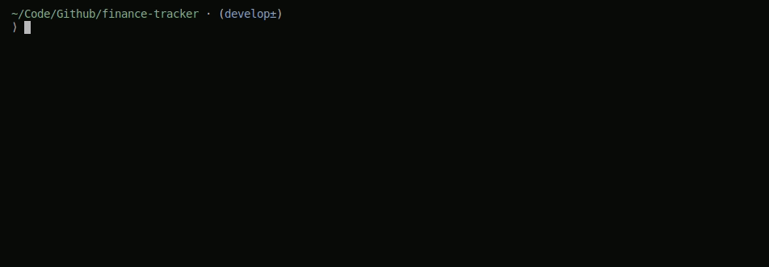
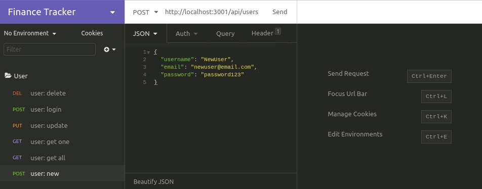
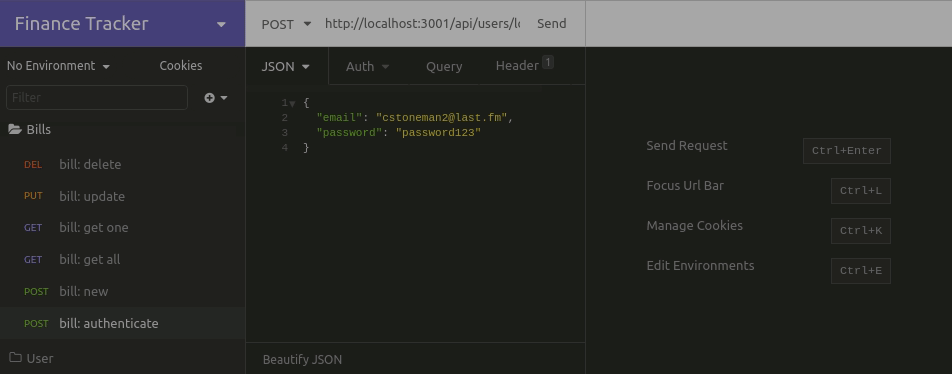
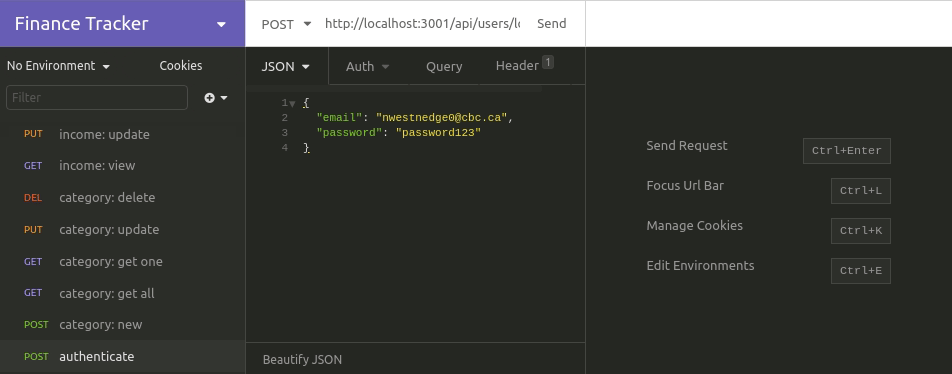
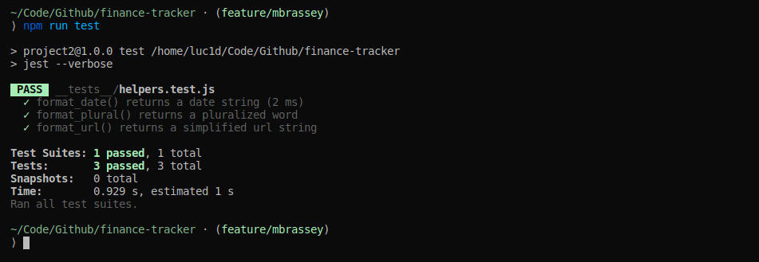

## Finance-Tracker

Full stack Financial application utilizing ORM with Sequelize and adhering to the Model-View-Controller paradigm. Handlebars Templating Engine was heavily utilized to modularize the views. On the back end, Express.js and SQL database are being used to provide robust REST API with multiple endpoints/routes. Authentication is required for the appropriate routes and user passwords are encrypted within the database using bcrypt. Test Driven Development has been demonstrated in this project using Jest.

#### Issues

- [x] [setup server file](https://github.com/mondrovic/Finance-Tracker/issues/1)
- [x] [feature/modelAssc](https://github.com/mondrovic/Finance-Tracker/issues/2)
- [x] [added user route](https://github.com/mondrovic/Finance-Tracker/issues/3)
- [x] [feature/apiRoutes mo](https://github.com/mondrovic/Finance-Tracker/issues/4)
- [x] [Authentication & Initial Views](https://github.com/mondrovic/Finance-Tracker/issues/5)
- [x] [Command Line Options & Readme File](https://github.com/mondrovic/Finance-Tracker/issues/6)
- [x] [added hbs server & home-route reflects homepage](https://github.com/mondrovic/Finance-Tracker/issues/7)
- [x] [fixed issue in utils/auth.js](https://github.com/mondrovic/Finance-Tracker/issues/8)
- [x] [Redirects, Hashed User Seed & Responsiveness](https://github.com/mondrovic/Finance-Tracker/issues/9)
- [x] [fixed logged in/out](https://github.com/mondrovic/Finance-Tracker/issues/10)
- [x] [fixed userid](https://github.com/mondrovic/Finance-Tracker/issues/11)
- [x] [Enable Helpers & Implement Tests](https://github.com/mondrovic/Finance-Tracker/issues/12)
- [x] [Show Authenticated User & Fix /new Controller](https://github.com/mondrovic/Finance-Tracker/issues/13)
- [x] [feature/chartJS](https://github.com/mondrovic/Finance-Tracker/issues/14)

#### Table of Contents

- [Requirements](#Requirements)
- [Installation](#Installation)
- [Usage](#Usage)
- [Screenshots](#Screenshots)
- [Developers](#Developers)
- [Questions](#Questions)
- [License](#License)

#### Requirements

    mysql or jawsdb
    node
    npm

#### Installation

    Create file: .env (in root directory)
        DB_NAME='<your_database_name>'
        DB_USER='<your_user_name>'
        DB_PW='<your_mysql_password>'
        SESS_SCRT='<random_generated_password>'

    npm i
    npm run migrate
    npm run seed

#### Usage

    Usage: node server.js [ -h | -v | -l | -a ]
    or: npm start

    [options]

           -h          Display this message.
           -v          Show version.
           -l          Show license info.
           -a          What is Finance-Tracker?

<h6>
:cyclone: Click the image(s) below to view the live <a id="Screenshots" href="https://finance-tracker-mondrovic.herokuapp.com/">webapplication</a>
</h6>

> Setup
> 

> User Routes
> 

> Post Routes (coming soon)
> 

> Comment Routes (coming soon)
> 

> Tests Passing
> 

#### Project Developers:

##### Matthew Ondrovic

> Creation in progress...

##### Matthew Brassey

> Creation in progress...

##### Ryan Brown

> Creation in progress...

##### Taylor Stern

> Project Advisor.

#### Questions

Contact me at [mondrovic1@gmail.com](mailto:mondrovic1@gmail.com) with any questions or comments.

#### License

`Finance-Tracker` is published under the **CC0_1.0_Universal** license.

> The Creative Commons CC0 Public Domain Dedication waives copyright interest in a work you've created and dedicates it to the world-wide public domain. Use CC0 to opt out of copyright entirely and ensure your work has the widest reach. As with the Unlicense and typical software licenses, CC0 disclaims warranties. CC0 is very similar to the Unlicense.
